# Aquilvyn

**A family wealth tracker with an AI advisor, built for Indian investors.**
It tracks Stocks, ETFs, Mutual Funds, NPS, EPF, VPF, PPF, FDs, bonds and gold for every member of the family. It analyses each holding technically and fundamentally. It then tells you what to do, whether that's *Buy more, Hold, Sell some, Sell or Switch*, and backs each call with:
- a short card and a full report, with the evidence and the rule that decided it,
- how sure it is (a confidence level — below 60 % it never tells you to trade),
- an optional cross-check by one or more AIs.

> Status: **early release — runs locally** on Windows, macOS or Linux, with or without Docker. No real orders are ever placed; broker execution is planned for a later phase and switched off.
> Recommendations are analysis for personal and family research. They are **not** SEBI-registered investment advice.

**Contents:** [What's different](#what-makes-aquilvyn-different) · [How it works](#how-it-works) · [Screenshots](#screenshots) · [Architecture](#architecture) · [How a call is made](#how-the-advisor-makes-a-call) · [Mutual fund plan](#mutual-funds-one-plan-per-person) · [Readiness engine](#the-readiness-engine-self-healing-data) · [Engines](#engine-catalogue) · [Features](#features) · [Quick start](#quick-start) · [Configuration](#configuration) · [Roadmap](#roadmap) · [Contributing](#contributing)

---

## What makes Aquilvyn different

| Capability | How Aquilvyn does it |
|---|---|
| Family / profile-wise tracking | Household → profiles (PAN-tagged) → portfolios; statements land on the right person automatically |
| Stocks · MF · NPS · EPF · PPF | All in one ledger, plus live NSE/BSE prices over WebSocket |
| Import from **any** broker | One reader finds the table by its columns (not the broker's name); unknown layouts are mapped once and remembered |
| Tells you **what to do** for each holding | A versioned, rule-based advisor with evidence. **Conflict-free**: no products are sold. |
| Too many mutual funds? | **One decision per fund, per person**: keep one fund per role, hold decent old funds, switch laggards into named better funds — in steps that fit the yearly tax-free gain |
| See through your funds | MF look-through: your true stock exposure (direct + inside funds) and how much your funds overlap |
| Never guesses | No buy/sell call without price history and fundamentals; missing data is said out loud ("Hold · data missing") |
| Self-healing data | The Readiness engine checks every holding every 15 minutes and fixes stale fundamentals, technicals, analysis and AI reviews |
| Explains *why*, with proof | Short and full reports with a decision trace and a reproducible input hash |
| Multi-AI verification | Claude · OpenAI · Gemini · Groq · Cloudflare · Ollama, in your order with automatic fallback; the AI can soften a call, never start a trade |
| Tax-aware | FY capital-gains engine (post-Jul-2024 rules), LTCG harvesting you can act on, "wait N days for LTCG" hints; the advisor and the Tax page share one ₹1.25 lakh allowance, so they never contradict each other |
| Risk-aware | Automatic trailing stops for trades, volatility-based buy sizing, smaller steps in a correction |
| Knows locked money | EPF/PPF/NPS are never suggested for selling; rebalancing is done by redirecting new money |

> [!NOTE]
> **Broker support:** imports are **fully tested with Zerodha**. Files from other brokers (ICICI Direct, Upstox, Groww, Paytm Money, SBI Securities, Kotak and others) are supported and should work, but have **not been tested with real exports yet**. If a file doesn't import correctly, please [open an issue](https://github.com/samhitrix/Aquilvyn/issues) with the broker name, the report you downloaded and the error message — and attach a sample only after removing names, PAN, account numbers and amounts.

---

## How it works

<p align="center">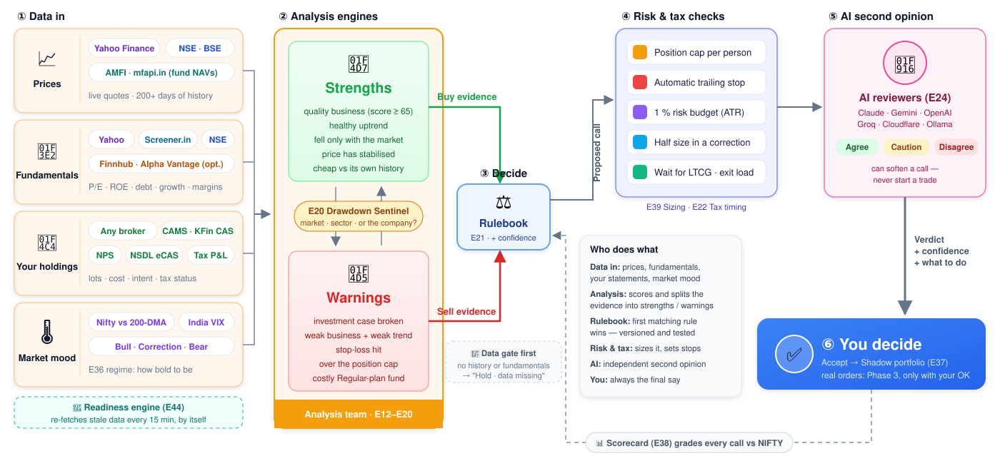</p>

Data comes in from market sources and your own statements. The analysis engines score it and split the evidence into **strengths** and **warnings**. The versioned **rulebook** makes the call, **risk & tax checks** size it and set stops, **AI reviewers** give an independent second opinion, and **you** always have the final say. The **Readiness engine** keeps every input fresh, and the **Scorecard** grades every past call against NIFTY.

## Screenshots

*Demo family with simulated prices — no real data.* Click any image to see it full size.

<p align="center"><a href="docs/screenshots/dashboard.png">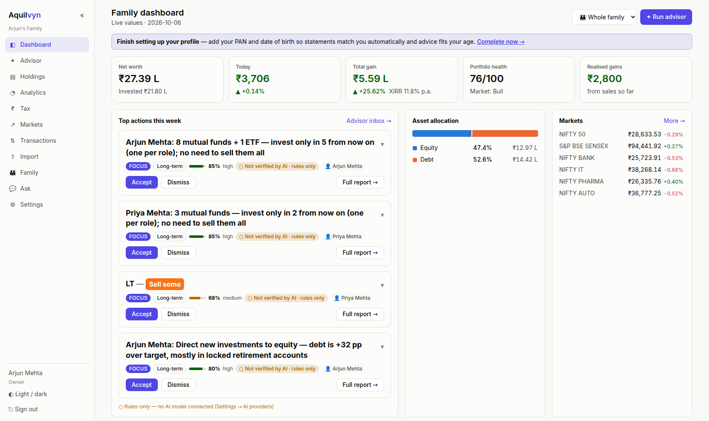</a><br><b>Family dashboard</b></p>

**New in Phase 2 — mutual funds, one plan per person**

<table>
<tr><td width="50%"><b>Fund plan — keep one fund per role, hold or switch the rest</b><br><a href="docs/screenshots/fund-plan.png">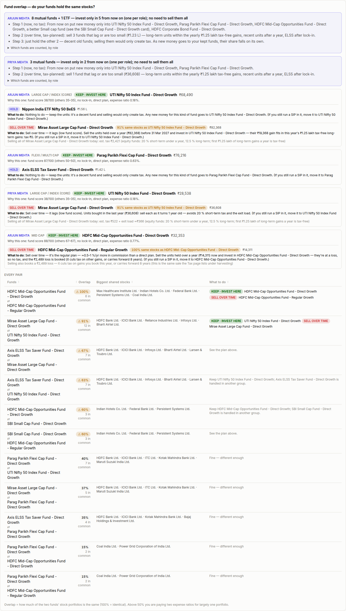</a></td><td width="50%"><b>Decision: Switch — where to, why, and tax-friendly steps</b><br><a href="docs/screenshots/advisor-switch.png">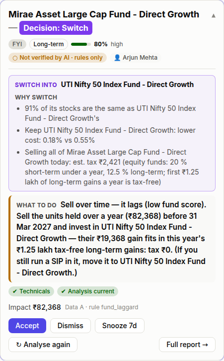</a><br><br><b>Tax harvesting that follows the plan (one ₹1.25 lakh allowance)</b><br><a href="docs/screenshots/tax-harvest.png">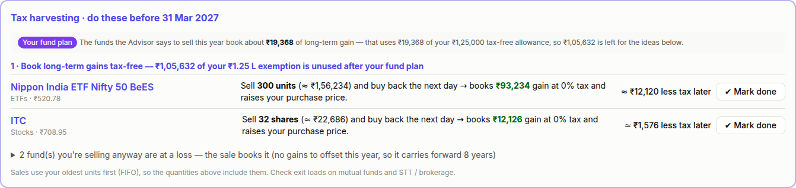</a></td></tr>
<tr><td colspan="2"><b>Look-through — your true stock exposure, direct + through your funds</b><br><a href="docs/screenshots/lookthrough.png">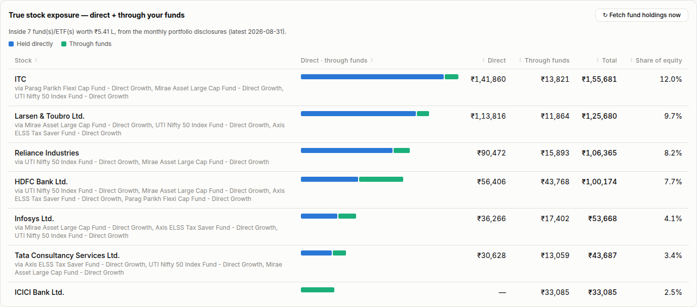</a></td></tr>
</table>

**Every tab**

<table>
<tr><td width="50%"><b>Holdings</b> — sort by any column, search, SIP badge<br><a href="docs/screenshots/holdings.png">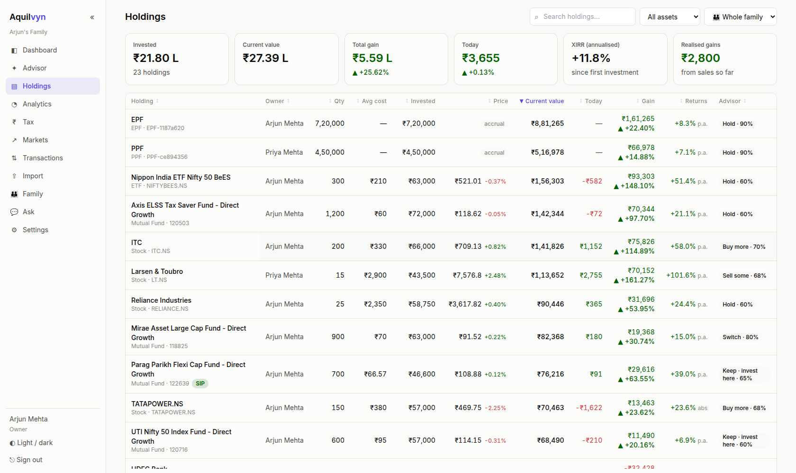</a></td><td width="50%"><b>Advisor</b><br><a href="docs/screenshots/advisor.png">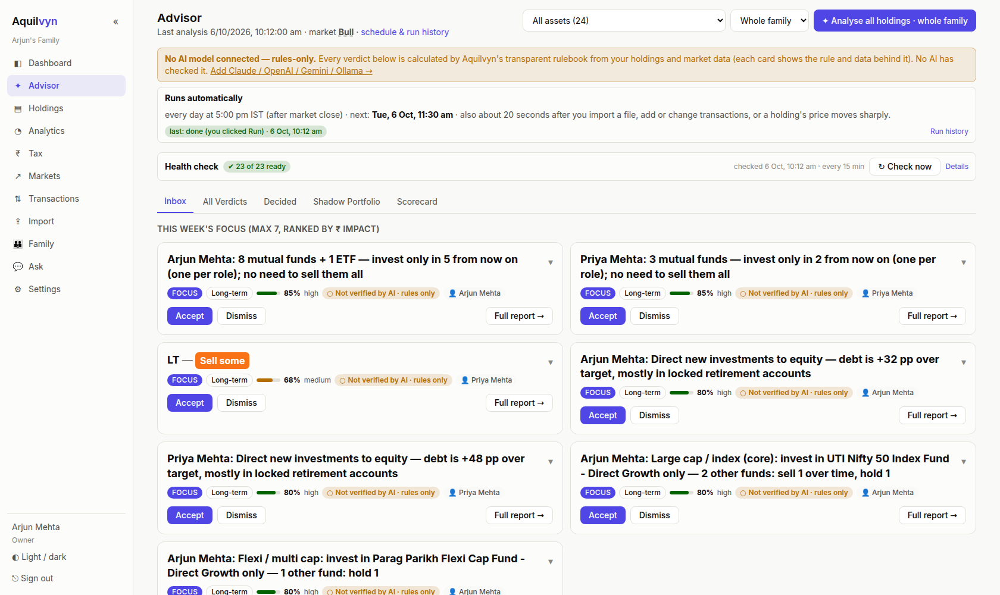</a></td></tr>
<tr><td width="50%"><b>Advisor — full report</b><br><a href="docs/screenshots/advisor-report.png">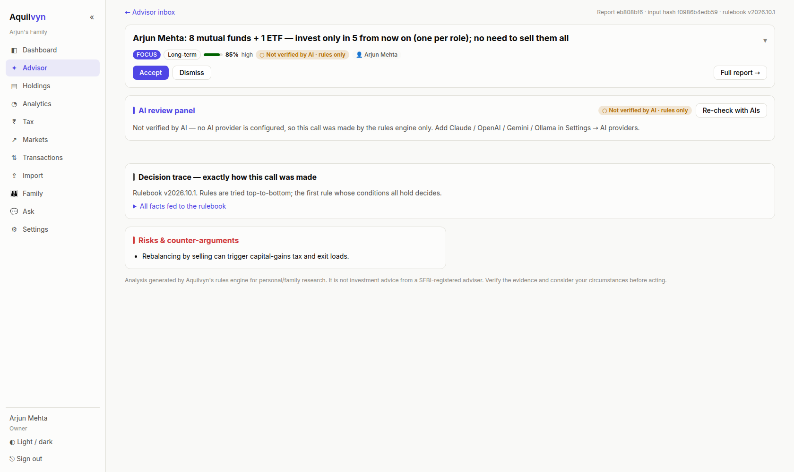</a></td><td width="50%"><b>Analytics</b><br><a href="docs/screenshots/analytics.png">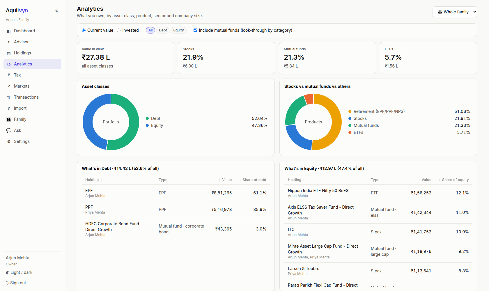</a></td></tr>
<tr><td width="50%"><b>Tax</b><br><a href="docs/screenshots/tax.png">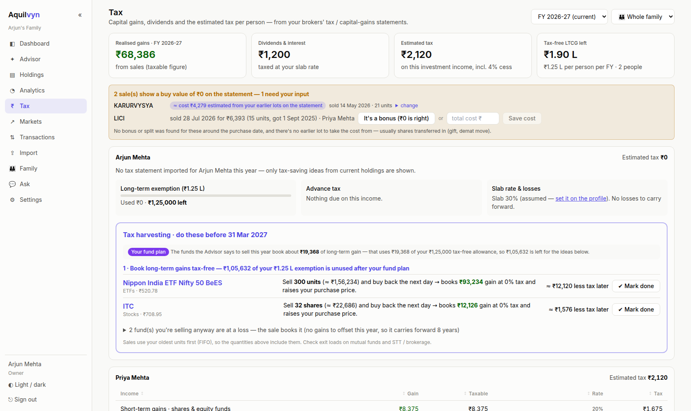</a></td><td width="50%"><b>Markets</b><br><a href="docs/screenshots/markets.png">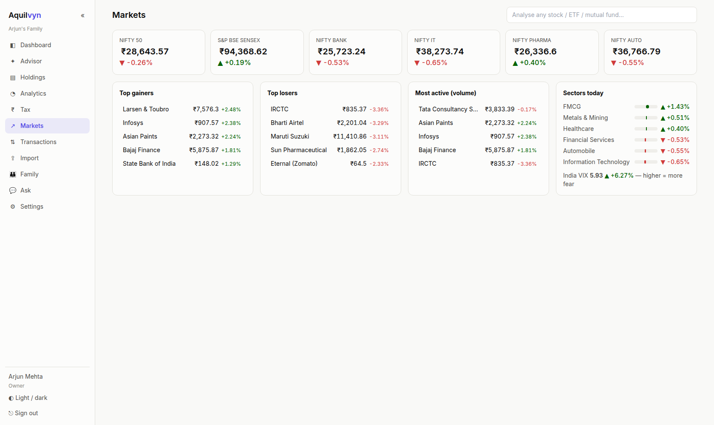</a></td></tr>
<tr><td width="50%"><b>Transactions</b><br><a href="docs/screenshots/transactions.png">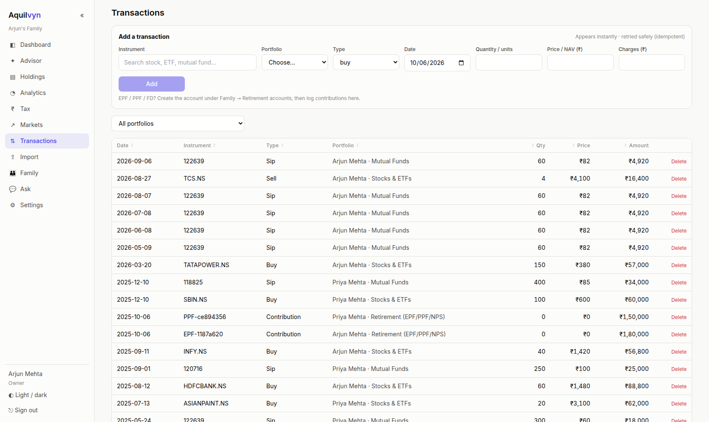</a></td><td width="50%"><b>Import</b><br><a href="docs/screenshots/import.png">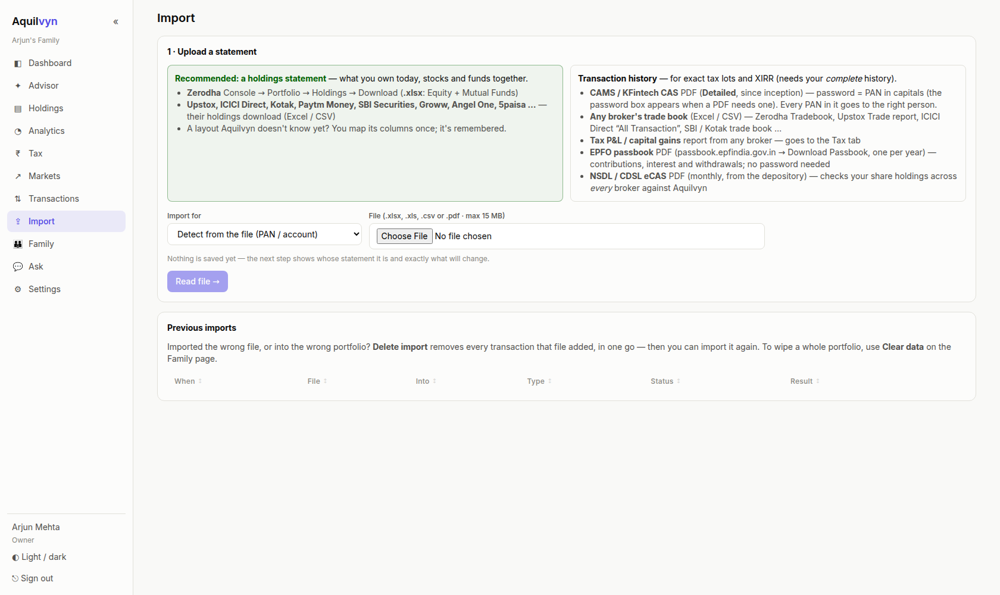</a></td></tr>
<tr><td width="50%"><b>Family</b><br><a href="docs/screenshots/family.png">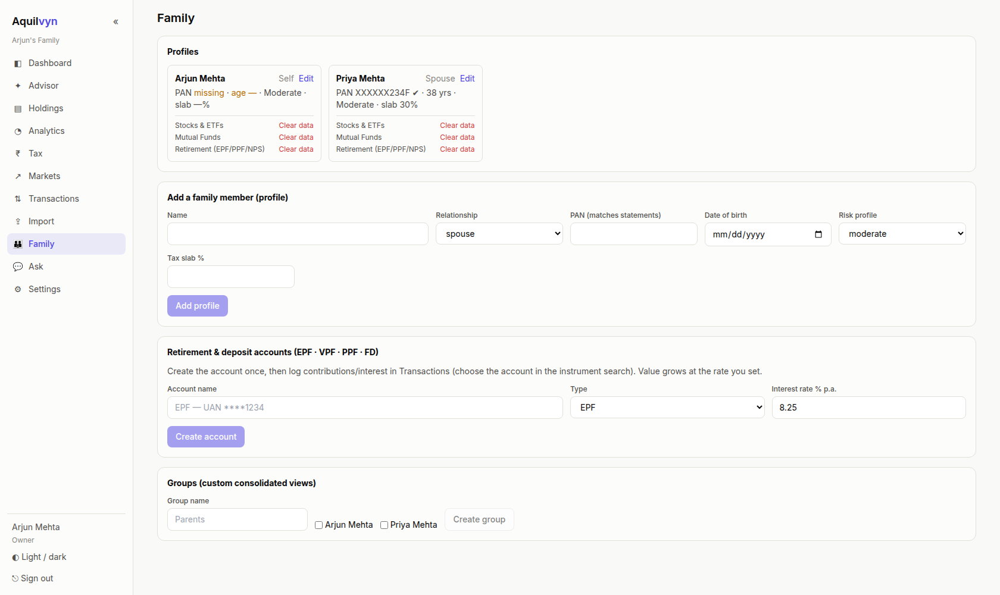</a></td><td width="50%"><b>Settings</b><br><a href="docs/screenshots/settings.png">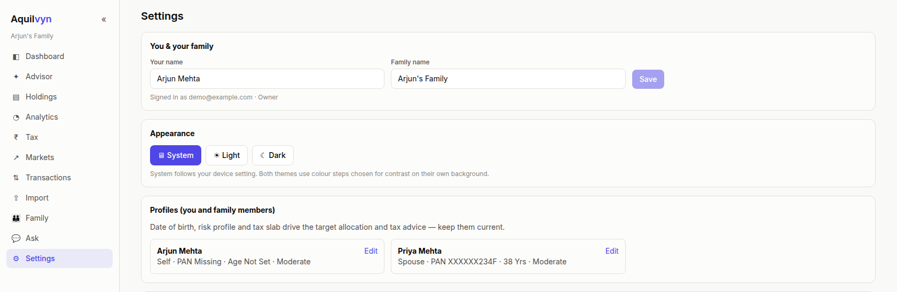</a></td></tr>
</table>

## Architecture

Seven FastAPI services (identity, portfolio, market, analytics, advisor, dashboard, readiness) sit behind one nginx gateway and share PostgreSQL and Redis. The engines each one contains are listed in the [Engine catalogue](#engine-catalogue).

**Events** (Redis Streams) keep everything in step without anyone pressing a button:

| Event | Emitted by | Who reacts |
|---|---|---|
| `txn.recorded` / `txn.updated` / `txn.deleted`, `import.completed` / `import.deleted` | portfolio | advisor re-analyses that household (debounced); readiness re-checks |
| `price.moved` | market | advisor re-analyses holdings with a big move |
| `holding.prefs_changed`, `profile.updated` | portfolio | advisor re-runs with the new intent / risk profile |
| `fundamentals.updated` | market | readiness re-checks every holding of that stock |
| `advisor.run_done`, `advisor.reviews_done` | advisor | readiness re-checks what the run touched |
| `member.registered`, `corporate_action.detected` | identity / market | portfolio creates the Self profile / adjusts the ledger |

**Scheduled jobs** (IST): EOD prices 16:15 on weekdays · portfolio snapshots 16:30 · nightly advisor 17:00 · scorecard 18:00 · corporate actions 18:30 · readiness sweep every 15 minutes.

---

## How the advisor makes a call

Every holding goes through the same pipeline. Gates come first, so a missing number can never turn into a trade.

```mermaid
flowchart LR
    classDef step fill:#fee2e2,stroke:#991b1b,color:#111
    classDef gate fill:#fef3c7,stroke:#b45309,color:#111
    classDef out fill:#dcfce7,stroke:#15803d,color:#111
    classDef ai fill:#fce7f3,stroke:#9d174d,color:#111

    S["E17 Signals<br/>price · 200 daily bars · fundamentals<br/>tax lots · regime"]:::step
    Q{"E34 Data gate<br/>history? fundamentals?"}:::gate
    I["E18 Intent<br/>Core · Satellite · Trade<br/>Retirement · auto or yours"]:::step
    SC["E19 Scores 0–100<br/>technical · fundamental<br/>fund quality · risk · tax"]:::step
    DD["E20 Drawdown Sentinel<br/>fall split into market /<br/>sector / company"]:::step
    R["E21 Rulebook YAML<br/>first matching rule wins<br/>regime-aware"]:::step
    SZ["E39 Sizing & stops<br/>trailing stop · 1 % risk budget<br/>half size in a correction"]:::step
    T["E22 Tax timing<br/>wait for LTCG? exit load?"]:::step
    REP["E23 Report<br/>verdict + confidence + one<br/>'what to do' line"]:::out
    AIR["E24 AI review<br/>can lower confidence or turn<br/>a sell into hold — never start a trade"]:::ai
    HOLDD["Hold · data missing<br/>(AI gives its own opinion)"]:::out

    S --> Q
    Q -- "missing" --> HOLDD
    Q -- "ok" --> I --> SC --> DD --> R --> SZ --> T --> REP --> AIR
```

**The rulebook** (`services/advisor/advisor_svc/rulebook.yaml`, hot-reloaded, every rule has a golden test) — main rules in the current version, **2026.10.1**:

| Situation | Call |
|---|---|
| Price history or fundamentals missing | **Hold · data missing** — never buy/sell on guesses |
| Trade: price closes below its stop | **Sell.** The stop is automatic: the higher of *cost − 2×ATR* and the trailing *22-day high − 3×ATR*; it only moves up. Your own stop wins if you set one |
| Trade: below its 20-day average | **Sell** — the setup has failed |
| Investment case broken (thesis failed) | **Sell 50 % now**; the rest if the trend breaks too or it hasn't recovered in 45 days |
| Weak business, weak trend, core holding | **Sell 50 % now**, the rest after 45 days |
| Quality stock falling with the market | **Buy more gradually** — only once it has stabilised (above 20-DMA, no new 20-day low for 5 days); until then *Hold — wait* |
| Market in correction / bear | No new money into Satellite / Trade ideas; Core buys at half size; never panic-sell quality |
| Winner in a euphoric market | **Hold and protect the gain** with a trailing stop — don't cut winners |
| Over the position cap | **Sell some** back down to the cap |
| Regular-plan mutual fund | **Switch to Direct** — staged if units are under a year old (new SIPs now, move old units after the LTCG date) |
| Lagging active fund | **Switch** — and it names where to: the best-scored funds of the same category right now, a better one you already hold first (index funds are never "laggards") |
| Two or more funds doing the same job | **Keep one per role** — see [Mutual funds: one plan per person](#mutual-funds-one-plan-per-person) |
| EPF / PPF / NPS | **Hold** — redirect new money instead |

Buy amounts are capped so a 2×ATR fall on the new money costs at most 1 % of the portfolio.

---

## Mutual funds: one plan per person

Many families end up with 20–30 funds: old SIPs nobody stopped, NFOs, a fund per relative's advice. Selling them all only creates tax. The advisor builds **one plan per person** — every fund gets exactly one decision, and every page (Advisor, Analytics, Tax) shows the same one:

| Fund | Decision | What you do |
|---|---|---|
| The best fund you hold in a role (large cap / index, flexi, mid, small, debt, gold, international) | **Keep · invest here** | New money — SIPs and lump sums — for that role goes here |
| A decent fund that is merely redundant | **Hold** | Nothing to sell (that only creates tax). If a SIP still runs in it, move the SIP to the kept fund; its share shrinks on its own |
| A laggard (low fund score) or a tiny leftover | **Switch** | Sell in tax-friendly steps: long-term units within this year's ₹1.25 lakh tax-free gain (what's left of it — the Tax page's figure), the rest after 1 April, recent units once a year old, ELSS units as they unlock |
| A role where even your best fund lags | **Switch** | Into the best-ranked fund of that category in the market right now |

- **Per person, never mixed.** A plan only ever covers one person's funds; the person / group / portfolio selector filters what you see.
- **Active SIPs are read from the statement.** A CAMS / KFintech CAS has every purchase: a purchase last month, or a regular monthly pattern, means the SIP is still running — shown as a **SIP** badge on Holdings (search "sip" to list them). A broker holdings file has no purchase dates, so there it shows **SIP ?** — click it to say yes / no yourself; your answer is used by the advisor too.
- **Your running SIP decides where new money goes** — unless that fund lags. A new SIP is never "too small to matter", and a fund whose score hasn't loaded yet is never treated as the worst.
- **One tax allowance, counted once.** The gain the plan books this year comes off the Tax page's ₹1.25 lakh before it suggests any gain harvesting, and a fund you're selling is never offered as "sell and buy back". Losses on funds you're selling are shown as part of the switch.
- **The AI can comment, not overrule.** On a fund-plan decision the AI's view is shown next to it, but the plan stays the one decision.

---

## The Readiness engine (self-healing data)

A separate service (`readiness-svc`) that keeps asking four questions about every holding and fixes a "no" by itself:

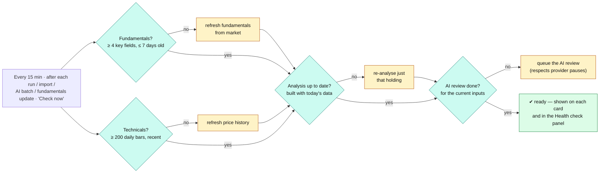

Failed fixes back off (10 min → 30 min → 2 h → 12 h) and the last error is stored, with API keys masked, so the UI shows *why* something is not ready.

---

## Engine catalogue

| Service | Engines | Port (dev) |
|---|---|---|
| `gateway` (nginx) | E01 API Gateway | 8080 |
| `identity-svc` | E02 Identity (email + Gmail/OIDC login, JWT, refresh rotation), members, audit read API | 8001 |
| `portfolio-svc` | E05 Ledger · E06 Holdings & Valuation · E07 Import (universal broker reader, column mapper, CAS, NPS, EPFO passbook, depository eCAS check, CAS-wins de-duplication) · E08 Family & Profiles · E28 Tax (FY gains, set-off, harvesting) · E35 ledger-side corporate actions | 8002 |
| `market-svc` | E10 Market Data (multi-source fundamentals chain, ISIN lookup, coverage) · E11 Live Price Stream · E16 MF holdings (monthly fund portfolios, same-category peers) · E34 Data Quality · E35 Corporate Actions | 8003 |
| `analytics-svc` | E12 Technical (incl. ATR, Chandelier stop, 20-day low) · E13 Fundamental · E14 MF analytics (incl. category peer ranking) · E16 Look-through & overlap · E15 Risk · E36 Market Regime | 8004 |
| `advisor-svc` | E17–E26 AI Advisor · E37 Shadow · E38 Scorecard · E39 Sizing & stops · E42 Priority | 8005 |
| `dashboard-bff` | E09 Dashboard Aggregator | 8006 |
| `readiness-svc` | **E44 Readiness** (checks + fixes per holding) | 8007 |
| `libs/fm_common` | E03 RBAC · E04 Rate-limit · E33a Event bus · E33c Cache · E33d Logging + PII masking · E33f Tracing · secret redaction · encryption | — |
| workers (Arq) | E33b: EOD refresh, snapshots, nightly advisor, AI reviews, scorecard, readiness sweep, monthly fund holdings, CAS / broker de-duplication | — |

E-numbers are the project's engine IDs; engines not listed here belong to later phases (see [Roadmap](#roadmap)).

---

## Features

- **Family first.** A household has members (logins with roles) and profiles (self, spouse, parents, kids, HUF). Each profile has its own portfolios, PAN (encrypted; used to route statements), optional email and mobile, tax slab, risk profile and target allocation. The family name is editable.
- **All instruments.** Stocks, ETFs and REITs (NSE/BSE), mutual funds (AMFI NAV), NPS, and accrual accounts (EPF/VPF/PPF/FD/bonds).
- **Ledger and holdings.** FIFO lots, realised and unrealised P&L, XIRR, dividends. Splits and bonuses applied automatically. Overselling is rejected.
- **Import — from any broker.**
  - Trades and holdings from Zerodha, ICICI Direct, Upstox, Groww, Paytm Money, SBI Securities, Kotak and others: the table is found by its columns anywhere in any sheet, with title rows, the broker's own buy/sell words and date formats.
  - An unrecognised layout is **mapped once** (with a guess from the column values) and remembered by its header fingerprint.
  - Broker codes are turned into NSE symbols through the ISIN. F&O rows are skipped.
  - CAMS/KFintech CAS PDF (mutual funds), NPS CRA statements, broker tax P&L statements.
  - **EPFO member passbook** PDF: contributions, withdrawals and interest per year, with an optional *total EPF balance* field for earlier employers the passbook doesn't show.
  - **NSDL/CDSL eCAS** is used as a *holdings check across every broker* (ok / differs / missing / extra) — never imported, because it has no cost. CDSL's own table layout is read directly.
  - **No double counting.** A mutual fund in both a CAS (demat + non-demat units, real purchase history) and a broker holdings file (demat units only) counts once — the CAS wins, matched by ISIN or scheme code, in whichever order you import them. Data imported earlier is fixed in the background.
  - A password is asked for only when the PDF is protected.
  - Review before import: what will change, for which person; write-once commits; restore and one-click undo.
- **Live market.** Quotes over WebSocket; indices, VIX, sectors, gainers/losers; a technical and fundamental page for every stock.
- **Analytics.** Asset classes (and what's inside debt, equity and gold), stocks vs funds, sectors, company size.
- **MF look-through.** Your *true* stock exposure — held directly + inside your mutual funds and ETFs — and how much your funds overlap ("Fund A holds 73 % of the same stocks as Fund B"). Fund holdings are fetched automatically every month from the monthly portfolio disclosures (Groww's fund pages first, each fund house's own file as backup — opened in a headless browser when the site needs JavaScript); liquid, gold and debt funds are left out. The advisor flags hidden concentration (a stock over your cap once funds are counted) and turns overlap into the [fund plan](#mutual-funds-one-plan-per-person).
- **AI Advisor.** Every holding gets an intent, scores, a drawdown check, a rulebook action with confidence, sizing, a tax hint and a clear "what to do" line. Clean colour-coded tiles, Accept / Dismiss, run for one holding or all, run history and schedule.
- **Multi-AI review.** Any mix of Claude, OpenAI, Gemini, Groq, Cloudflare Workers AI or local Ollama, in the order you set; a provider out of quota is skipped for 24 h. Leave the model name empty and a current model is picked from the provider's live list (a retired model is replaced automatically). The previous review stays valid until a new one lands. With no AI configured, it runs in *rules-only* mode.
- **Tax.** FY capital gains under the Jul-2024 rules, loss set-off and carry-forward, LTCG exemption use, harvesting suggestions with mark-as-done. Harvesting follows the advisor's decision on each fund and never suggests selling ELSS units still in their 3-year lock-in.
- **Tables you can work with.** Every table sorts by any column (the choice is remembered like a filter); Holdings has a search box (name, symbol, owner, type or the advisor's verdict).
- **Proof layer.** "Accept" records a virtual trade in the **Shadow Portfolio**; the **Scorecard** re-prices every call at 30, 90, 180 and 365 days against NIFTY.
- **Settings.** Test every AI model and every data source from one page; account and family names; AI on/off.
- **Accounts and passwords.** Email + password or Gmail. No email server needed to recover a password: a **recovery code** is shown once at sign-up (and at the next sign-in for older accounts) — *Forgot password?* takes your email + code. Lost both? The household owner makes a one-time reset link for a member in Settings; the owner can make one with `python scripts/fm.py reset-password` on the computer running Aquilvyn.
- **Fast and observable.** Background work (live-price polling, data refreshes, re-analysis) runs in workers, never in the processes that serve pages; live prices are polled only in market hours and back off when a source refuses. `python scripts/fm.py perf` — no login needed — shows every service's health, CPU, the exact code line that kept it busy and its slowest routes.
- **Security and ops.** OIDC/Gmail login; 15-minute JWTs; rotating refresh tokens with reuse detection; RBAC; Redis rate limiter; secrets masked in every stored or displayed error; PII-masked JSON logs; OpenTelemetry traces; immutable audit log.

---

## Tech stack
**Backend:** Python 3.12 (3.11–3.13 locally), FastAPI, uvicorn; SQLAlchemy 2 (async) + asyncpg, Alembic (16 migrations); Redis (cache, Streams, pub/sub), Arq; structlog, OpenTelemetry, numpy, yfinance + curl_cffi, casparser, PyMuPDF, openpyxl, Playwright (headless Chromium, market service only).

**Frontend:** Next.js 14 (App Router), TypeScript, TanStack Query v5, Tailwind, lightweight-charts. Responsive, with Light / Dark / System themes.

**Infra:** Docker Compose, nginx, PostgreSQL 16 (15–18 locally), PgBouncer, Vector, Loki, Tempo, Grafana.

## Quick start
```bash
git clone https://github.com/samhitrix/Aquilvyn.git && cd Aquilvyn
python scripts/fm.py setup      # creates .env with generated secrets (and adds new settings later)
python scripts/fm.py up-lite    # Docker: core stack   (or: up = with Grafana/Loki/Tempo)
# open http://localhost:8080
```
Without Docker: `python scripts/fm.py db-init`, then `python scripts/fm.py dev`, then `cd web && npm run dev`.
Check your setup with `python scripts/fm.py doctor`. Full step-by-step instructions are in **[docs/RUNNING.md](docs/RUNNING.md)**.

## Repository layout
```
libs/fm_common/        shared platform engines (logging, cache, rate-limit, identity, events, db, redact, crypto, telemetry)
services/identity/     identity-svc          services/portfolio/   portfolio-svc (ledger, importers/, tax)
services/market/       market-svc (providers/)  services/analytics/ analytics-svc
services/advisor/      advisor-svc (rulebook.yaml, ai/)          services/dashboard/  dashboard-bff
services/readiness/    readiness-svc (checks, fixes)
migrations/            Alembic (all schemas + audit triggers)
web/                   Next.js web app
infra/                 nginx, Dockerfiles, Vector, OTel, Tempo, Loki, Grafana, health-ping
scripts/               fm.py (every command), dev.py (run without Docker)
tests/                 unit tests (synthetic fixtures) + end-to-end smoke test
docs/                  RUNNING.md (how to run) · how-it-works.svg
```

## Configuration
Everything works without any API keys: prices come from free public sources and the advisor runs in *rules-only* mode. Optional settings in `.env` (or in the app under **Settings**):

| Setting | What it adds |
|---|---|
| `MARKET_DATA_PROVIDER` | `yahoo` (default) for live NSE/BSE prices, or `simulated` for an offline demo |
| `ANTHROPIC_API_KEY`, `OPENAI_API_KEY`, `GEMINI_API_KEY`, `GROQ_API_KEY`, `CLOUDFLARE_API_TOKEN`, `OLLAMA_MODEL` | AI reviewers — use any mix; they are tried in the order you set |
| `FINNHUB_API_KEY`, `ALPHAVANTAGE_API_KEY` | Extra fundamentals sources (optional) |
| `OIDC_ENABLED`, `OIDC_CLIENT_ID`, `OIDC_CLIENT_SECRET` | "Login with Gmail" — shown only when `OIDC_ENABLED=true` and both keys are set ([setup guide](docs/RUNNING.md#login-with-gmail-optional)) |

**Settings → Test all** checks every AI model and data source and shows why one fails. Keys stay in your own `.env` or are stored encrypted in your database — never commit them. Details: [docs/RUNNING.md](docs/RUNNING.md).

## Roadmap

| Phase | Scope | Status |
|---|---|---|
| **1 — Foundation** | Family tracking and dashboards, live market, rule-based advisor with reports, multi-AI review, shadow portfolio and scorecard, tax engine and harvesting, any-broker import, Readiness engine, security and observability | ✅ Available |
| **2 — Depth** | MF look-through and fund overlap · one mutual-fund plan per person (keep one fund per role, switch laggards into named funds, tax-phased) · EPFO passbook import · CDSL eCAS reading · CAS / broker de-duplication by ISIN · active-SIP detection · AI model auto-pick · sortable tables and holdings search | ✅ Available |
| **2.1 — More depth** | Scenario tests and rulebook backtesting · ITR capital-gains export (Schedule CG / 112A) · document vault · alerts and push notifications · behavioural coach · red-flag and events tracking · nominee tracking · contract-note readers · email auto-import · F&O and liabilities | 📋 Planned |
| **3 — Action** | Read-only broker API sync; approved actions sent to a broker or MF platform only after your explicit approval; advisor/CA multi-client mode; Account Aggregator | 🔒 Designed, switched off |
| **4 — Mobile** | Mobile app with offline sync, biometric unlock and push | 📋 Planned |

## Contributing
Issues and pull requests are welcome.
- Every command runs through `python scripts/fm.py <target>` (no `make` needed; works on Windows).
- Before opening a PR: `python scripts/fm.py lint` and `python scripts/fm.py test`; for web changes also `cd web && npx tsc --noEmit && npm run build`; for behaviour changes run `python scripts/fm.py dev` and `python scripts/fm.py smoke --direct`.
- Every change to the advisor rulebook needs a golden test case in `tests/unit/test_rules.py`.
- Tests use synthetic data only — never add real statements, PANs, names or amounts, and never commit API keys.
- By submitting a contribution you agree that it is licensed under the same terms, and that the maintainer may also license it to others, including commercially.

## License
Aquilvyn is **source-available for personal, non-commercial use** under the [PolyForm Noncommercial License 1.0.0](LICENSE).

- ✅ **Allowed:** using it for yourself and your family, studying it, changing it for your own use, hobby and research projects, and use by charities, schools and other non-profit organisations.
- ❌ **Not allowed:** any commercial use — selling it or copies of it, offering it as a paid or hosted service, or using it inside a business.

Anyone who shares a copy must include the licence and the `Required Notice:` line at the top of [LICENSE](LICENSE). For commercial licensing, please open an issue to get in touch.

Third-party: charts use [TradingView Lightweight Charts™](https://www.tradingview.com/lightweight-charts/) (Apache-2.0), © TradingView, Inc.; all other dependencies are MIT, BSD or Apache-2.0 licensed and keep their own licences. Market data comes from third-party sources under their own terms and is for personal research only.

## Disclaimer
Aquilvyn is a personal and family research tool. Market data from free sources can be delayed or incomplete; every report shows its data-quality grade and sources. Nothing here is investment advice. Verify before you act.
